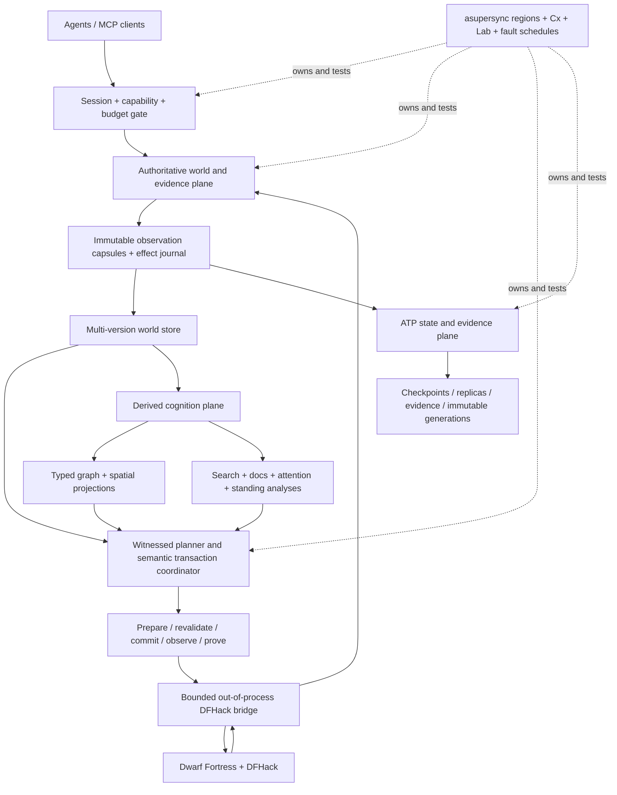

# dwarf_fortress_mcp

**A semantic, transactional, replayable control plane that lets autonomous agents operate
Dwarf Fortress as a long-lived civilization rather than click through it as a brittle user.**

> Status: **owned MCP transport laboratory on the deep architecture lock (Phase 0C)**. The MCP
> plane is the owned [`fastmcp_rust`](https://github.com/Dicklesworthstone/fastmcp_rust) sibling —
> modern-only **MCP 2026-07-28**, pinned to an exact upstream revision and dogfooded upstream —
> exposing the frozen 11-tool `fortress.*` waist over stdio against the deterministic laboratory.
> The substrate commitments stand: multi-version world state, witnessed semantic transactions,
> canonical graph decisions, root-last immutable publication, ATP-backed state/evidence movement,
> a closed dependency universe, and local-only qualification. There is still no live DFHack
> adapter. See [`IMPLEMENTATION_STATUS.md`](IMPLEMENTATION_STATUS.md) before interpreting any
> target-state prose as implemented behavior.

The originating observation was simple: Dwarf Fortress is almost the ideal environment for
long-horizon agents, yet there was no efficient MCP server through which Codex, Claude Code, or
similar systems could control the game while monitoring state and progress. A naive answer would
expose dozens of DFHack commands and screenshots as MCP tools. That would work just well enough
to become dangerous: observations would be expensive and incomplete, commands would acknowledge
dispatch rather than prove success, retries could duplicate effects, version drift would silently
corrupt assumptions, and no one could reconstruct why the fortress ended up in its present state.

`dwarf_fortress_mcp` takes the harder and more useful path. It treats the fortress as a
partially observed, continuously evolving typed world. It gives agents:

- compact, cursor-based semantic observations rather than repeated full dumps;
- a multi-version canonical world with provenance, stable identities, spatial chunks, and an
  append-only observation-capsule history;
- derived graph, search, and attention projections that can accelerate cognition without becoming
  authoritative;
- semantic intents compiled into immutable, capability-checked action DAGs with positive,
  negative, range, aggregate, spatial, and epoch witnesses;
- prepare/revalidate/commit semantics with idempotency, phantom protection, deterministic rebase,
  and proof-carrying merge;
- bounded obligations for work that completes later in game time;
- evidence-backed postcondition verification rather than “command returned success”;
- checkpoint, compensation, cancellation-drain, reconciliation, and deterministic replay;
- multi-agent ownership leases plus witnessed MVCC validation over entities, relations,
  resources, and map regions;
- explicit canonical tie-breaks and decision-path witnesses for graph-derived choices;
- content-addressed, resumable ATP movement of checkpoints, immutable generations, deltas, and
  evidence, never mutation authority;
- an out-of-process, versioned DFHack bridge with no C/C++ FFI in the Rust trust domain.

This is not “an LLM presses keys.” It is a small operating system for trustworthy agentic
stewardship of a simulated civilization.

---

## The central distinction

Dwarf Fortress has at least three different notions of success:

1. **Dispatch success**: the bridge accepted a request.
2. **Game mutation success**: a designation, order, assignment, or configuration appears in game
   state.
3. **Goal success**: dwarves actually finish the mine, construct the workshop, satisfy the work
   order, survive the siege, or stabilize the food economy.

Most automation APIs collapse all three into a Boolean. `dwarf_fortress_mcp` makes them separate
protocol states. A long-running operation is a **bounded obligation** with:

- a semantic terminal predicate;
- an optional failure predicate;
- a deadline measured in game ticks;
- an explicit polling cadence;
- a stability requirement across repeated observations;
- evidence references for every transition;
- a cancellation and compensation policy;
- an `indeterminate` state when the system cannot honestly know what happened.

That distinction is the foundation of reliable long-horizon control.

---

## Architecture at a glance

The design has three planes with one-way authority boundaries:



**Plane A, authoritative world and evidence:** the only source of truth for what was observed,
what effect was attempted, and what was proved. It uses multi-version semantic state and immutable
observation capsules.

**Plane B, derived cognition:** graph, spatial, retrieval, documentation, attention, and
incremental analyses. These may be rebuilt or discarded; they cannot authorize a mutation or
contradict canonical evidence.

**Plane C, effect boundary:** the smallest possible registered action vocabulary over a bounded,
versioned, out-of-process DFHack bridge. No graph algorithm, ATP peer, index, imported document,
or agent can bypass prepare/revalidate/commit/observe/prove.

### The narrow waist

The public MCP surface is intentionally small:

| Tool | Purpose |
|---|---|
| `fortress.open_session` | Negotiate versions, capabilities, budgets, compatibility, and initial anchor. |
| `fortress.observe` | Receive a bounded full view, heartbeat, or resumable state delta. |
| `fortress.query` | Run structured semantic queries without dumping the world. |
| `fortress.plan` | Compile an intent into an immutable, inspectable prepared plan. |
| `fortress.commit` | Revalidate and idempotently commit a prepared plan. |
| `fortress.wait` | Advance or poll bounded obligations and return only meaningful changes. |
| `fortress.cancel` | Request, drain, compensate when authorized, and finalize cancellation. |
| `fortress.checkpoint` | Create a content-addressed recovery point and evidence record. |
| `fortress.restore` | Restore a checkpoint into a new observation epoch. |
| `fortress.explain` | Explain state, plan, score, decision, or failure from evidence. |
| `fortress.doctor` | Diagnose compatibility, state, ledger, bridge, and recovery problems. |

The server may support thousands of game facts and many semantic action kinds without presenting
thousands of top-level tools. New game coverage normally extends schemas and registries, not the
MCP namespace.

---

## The mutation protocol

Every mutating operation follows the same sequence:

```text
intent
  → normalize
  → validate constraints and budgets
  → compile immutable action DAG
  → calculate risk and capabilities
  → prepare against state anchor
  → acquire scoped leases
  → checkpoint when policy requires it
  → re-read affected state
  → commit with idempotency keys
  → observe authoritative state
  → prove postconditions
  → discharge obligations
  → release leases
```

A plan is sealed over its intent, source state hash, steps, dependencies, preconditions,
postconditions, compensation actions, obligations, risk, capabilities, and expiry. `commit`
requires the plan ID, plan digest, prepare receipt, and expected anchor. Duplicate commit attempts
return the prior receipt rather than reapplying effects.

The following are never accepted as proof of goal completion:

- a successful JSON-RPC response;
- a DFHack command returning zero;
- a UI selection changing;
- a job being queued;
- elapsed wall-clock time;
- an agent asserting that the action “probably worked.”

Proof comes from later normalized game observations satisfying registered semantic predicates.

---

## Agent-efficient observation

A full fortress is much too large to serialize on every turn. Observation therefore uses five
complementary mechanisms.

### 1. Stable state anchors

Every authoritative view carries:

```json
{
  "fortress_id": "7",
  "cursor": {"epoch": 3, "sequence": 18422},
  "game_tick": 9120031,
  "state_hash": "sha256:…"
}
```

A mutation, query, continuation, or delta is tied to an anchor. Cursor gaps are explicit. Restores
and non-resumable discontinuities create a new epoch and require a full snapshot.

### 2. Interest sets

Agents subscribe to entity kinds, specific entity IDs, fields, map cuboids, event classes,
active plans, and obligations. Interests can be durable for a session or supplied per request.

### 3. Semantic deltas

Deltas contain typed upserts, removals, map-chunk changes, events, and evidence. Entity
generations prevent ABA identity reuse; revisions prevent stale updates; target hashes prove that
the receiver reconstructed the intended canonical state.

### 4. Token-budgeted projections

Every read has hard limits for entities, bytes, wall time, and output tokens. The server returns a
bounded projection and a continuation rather than silently truncating. Common summaries target
hundreds of tokens, not megabytes.

### 5. Attention ranking

An agent usually needs to know what matters, not everything that changed. The attention layer can
rank starvation risk, idle critical workshops, blocked jobs, military threats, mandate risk,
resource bottlenecks, unusual stress, and plan regressions. Every score carries a ledger showing
which signals contributed and which evidence supports them.

Target economics are defined in `docs/PERFORMANCE_BUDGETS.md`; they are acceptance targets, not
claims about the phase-zero scaffold.

---

## Canonical world model

The world model is a typed property graph plus spatial chunks and an event journal.

Typical entities include units, items, buildings, jobs, work orders, stockpiles, zones, burrows,
squads, military orders, syndromes, historical figures, civilizations, and fortress-level
aggregates. Edges encode relationships such as containment, assignment, membership, production,
requirements, threats, and causality.

Facts retain provenance:

```text
value
observed game tick
DFHack field or derivation identifier
source digest
schema version
confidence/compatibility status
```

The map is not represented as millions of graph nodes. It uses versioned chunks with terrain
run-length encoding, bitplanes for common flags, and sparse overlays for exceptional state. Graph
entities link into coordinates or regions when semantics require it.

The canonical model is deliberately distinct from:

- raw DFHack structures, which change across versions;
- MCP presentation JSON, which is budgeted and client-specific;
- search indexes, which are derived;
- plans, which refer to but do not redefine world truth;
- agent memory, which may be stale or speculative.

See `docs/WORLD_MODEL.md`.

---

## Semantic actions, not arbitrary commands

The initial action registry covers bounded, typed operations such as:

- pause or resume;
- designate mining, channels, stairs, ramps, or removal;
- place registered building kinds under material constraints;
- set labor assignments;
- create conditional manager work orders;
- configure stockpiles;
- assign squad membership;
- configure burrow membership;
- set registered standing orders.

An extension action must name a negotiated namespace and schema. The default server does **not**
expose arbitrary shell execution, Lua evaluation, DFHack command strings, memory writes, or file
paths. In-game text and imported documentation are data; they cannot grant capabilities or turn
into executable commands.

---

## What the Franken stack contributes

This is a substrate synthesis, not a collection of brand-name dependencies. Every imported
primitive has an invariant, failure boundary, replay story, benchmark, admission gate, and an
explicit list of tempting ideas that were rejected.

| Project | Most accretive imports |
|---|---|
| [`asupersync`](https://github.com/Dicklesworthstone/asupersync) | Sole runtime; region-owned work; `Cx` authority/deadline/budget flow; two-phase effects; request/drain/finalize cancellation with progress certificates; deterministic Lab; ATP verified object DAGs, RaptorQ repair, resumability, and path racing. |
| [`frankensqlite`](https://github.com/Dicklesworthstone/frankensqlite) | Multi-version semantic snapshots; positive and negative SSI witnesses; hierarchical no-false-negative conflict refinement; brief commit combining; deterministic intent replay; stable-key structural merge; trace-normal-form and post-state certificates. |
| [`frankenfs`](https://github.com/Dicklesworthstone/frankenfs) | Root-last immutable publication; crash matrices; lease-incarnation and generation fences; drain/drop/process queues; same-binary A/B receipts; generation-monotone repair; proof of retrievability; evidence-gated readiness. |
| [`frankensearch`](https://github.com/Dicklesworthstone/frankensearch) | Progressive cognition under budgets; one immutable generation per request; fail-closed coverage certificates; bounded non-recursive query arenas; deterministic fusion; adaptive policies with priors, clamps, minimum samples, and circuit breakers. |
| [`franken_markdown`](https://github.com/Dicklesworthstone/franken_markdown) | Dependency-light semantic core; exact source spans and recoverable diagnostics; deterministic transactional sibling publication; bounded direct MCP/JSON parsing; machine-readable doctor and capability surfaces. |
| [`frankengraphdb`](https://github.com/Dicklesworthstone/frankengraphdb) | One version universe; tiered graph storage; factorized and worst-case-optimal execution; incremental Z-set projections; branch-per-agent experimentation; capability filtering before expansion; reference oracles and plan certificates. |
| [`franken_networkx`](https://github.com/Dicklesworthstone/franken_networkx) | Canonical Graph Semantics Engine; explicit tie-break policies; complexity and decision-path witnesses; broad graph algorithms; behavioral conformance; immutable structural sharing; measured rather than ceremonial zero-copy design. |
| [`doodlestein_self_releaser`](https://github.com/Dicklesworthstone/doodlestein_self_releaser) | Workflows as local specifications; clean source snapshots; bounded native builds; exact asset contracts; checksums, signatures, SBOMs, and machine-readable release receipts without GitHub-hosted runner dependence. |

The detailed source-level adopt/adapt/reject analysis is in
[`FRANKENSTACK_DEEP_DIVE.md`](FRANKENSTACK_DEEP_DIVE.md). The machine-readable import contract is
[`architecture/franken_imports.json`](architecture/franken_imports.json).

---

## DFHack boundary

DFHack already provides the right starting primitives: an extensible protobuf-based remote
interface, external command connectivity, and rich Lua access to game structures. The production
bridge therefore remains out of process:

```text
safe Rust MCP server
    ↕ versioned bounded protocol
small DFHack-side bridge service
    ↕ supported DFHack APIs
Dwarf Fortress
```

The bridge normalizes raw structures into the project’s versioned semantic schema and accepts
only registered action messages. It is not part of the Rust trust domain, and the Rust workspace
does not link C or C++ code. UI automation and screenshots may be diagnostic fallbacks, but they
are never authoritative state.

See `docs/DFHACK_BRIDGE.md` and `proto/dfmcp.proto`.

---

## Platform and distribution support

Dwarf Fortress runs natively on Linux and Windows. As of the current 53.16 release (August 5,
2026) there is no native macOS build; the practical macOS path is a compatibility layer such as
Wine, Whisky, or CrossOver. DFHack follows the platforms the game itself supports, so current
DFHack releases target 64-bit Windows and Linux, and macOS remains a workaround rather than a
supported target (see the [DFHack documentation](https://docs.dfhack.org)).

Two official distributions of the same underlying simulation exist:

| Distribution | Cost | What it is |
|---|---|---|
| Dwarf Fortress Classic | Free | The complete simulation; the official Bay 12 release for Windows and Linux ([bay12games.com/dwarves](https://www.bay12games.com/dwarves/)) |
| Dwarf Fortress Premium | $29.99 | The same simulation with the polished graphical UI, art, music, and tutorials; sold on [Steam](https://store.steampowered.com/app/975370) and itch.io (the itch purchase includes a Steam key) |

DFHack's current releases are compatible with Steam, itch.io, and Classic builds
([DFHack releases](https://github.com/DFHack/dfhack/releases)), so no part of this project
depends on the paid edition. The control plane is edition-agnostic by design: every semantic
flows through the versioned DFHack bridge, never through edition-specific UI automation.
Designating the free Classic edition as the reference target keeps the entire agent stack
reproducible at zero licensing cost and keeps Steam out of the dependency graph entirely.

Tiered configuration targets:

| Tier | Configuration | Standing |
|---|---|---|
| 1 — canonical reference | Linux + Dwarf Fortress Classic (free) + DFHack | Primary development and compatibility target: a completely free, native, automatable stack |
| 2 | Linux + Dwarf Fortress Premium + DFHack | Supported |
| 3 | Windows + Dwarf Fortress (Classic or Premium) + DFHack | Supported |
| Best effort | macOS via Wine/Whisky/CrossOver + DFHack | Explicitly best effort; not a supported target |

## Multi-agent operation

Several agents may observe and plan against the same fortress. Safe concurrency uses two
orthogonal mechanisms: **leases** fence who may act, while **MVCC witnesses** prove that the facts,
absences, ranges, aggregates, spatial predicates, and compatibility epochs on which a plan relied
are still valid. Mutation may require explicit leases over one or more of:

- entity generations;
- map cuboids;
- resource classes or reservation lots;
- configuration domains;
- plan or obligation ownership;
- the simulation clock.

Leases have owners, scopes, epochs, expiries, fencing tokens, and budgets. Plans additionally
carry coarse sound witnesses that may be refined under a value-of-information budget. A query
that found “no hostile unit in this burrow,” “no job occupying this workshop,” or “fewer than ten
bars in this stockpile” creates a negative/aggregate witness so a later insertion cannot become an
invisible phantom. Disjoint plans may commit concurrently; overlapping plans attempt deterministic
intent replay, then stable-key structural merge, then reject and replan. Every accepted merge has
a canonical certificate.

This lets a military planner, production optimizer, diagnostician, architect, and logistics agent
cooperate without a global mutex and without optimistic hand-waving.

---

## Security posture

The safe default is localhost, single fortress, read-only capabilities, no ambient filesystem or
network access, and no arbitrary command escape hatch. Mutation requires explicitly granted,
short-lived capability scopes. Guarded actions can require both a checkpoint and a human or
policy confirmation seal.

Core threat classes include:

- prompt injection through names, announcements, books, imported Markdown, or mod text;
- oversized or cyclic bridge payloads;
- version drift and unknown enum values;
- replayed prepare or commit receipts;
- duplicate effects after retry;
- stale observations and ABA entity reuse;
- compromised or buggy DFHack bridge behavior;
- path traversal through saves or evidence bundles;
- lease theft and multi-agent conflicts;
- crash windows that leave effects indeterminate.

See `SECURITY.md` and `docs/THREAT_MODEL.md`.

---

## Determinism and evidence

Every core state transition is designed to be replayable from:

- protocol inputs;
- canonical observations and deltas;
- injected game time and wall time;
- deterministic IDs and idempotency keys;
- adapter receipts;
- storage and filesystem effect transcripts;
- registered fault decisions.

A doctor bundle should be enough to reproduce a failure without the original fortress process
whenever the necessary snapshots are legally and practically available. Replay divergence is a
first-class failure with the earliest mismatching anchor, field, or effect.

---

## Repository state

The semantic crates have no external runtime dependencies; the presentation crate adds the pinned
owned MCP sibling and admitted fundamentals. The system is safe Rust 2024 on the latest nightly
toolchain with a **closed dependency universe**: `asupersync`, owned Franken-suite crates, the
owned `fastmcp_rust` MCP plane (modern-only, pinned; ADR-013), and explicitly admitted
fundamental serialization crates. The policy rejects alternative runtimes, non-owned MCP
frameworks, generic graph/database/web stacks, native FFI, and hidden background executors. The
workspace contains:

- `dfmcp-core`: IDs, hashes, anchors, capabilities, budgets, evidence, errors, and outcomes;
- `dfmcp-world`: typed graph, spatial chunks, canonical hashing, queries, and strict deltas;
- `dfmcp-intent`: semantic actions, constraints, immutable plans, and obligations;
- `dfmcp-adapter`: the out-of-process game adapter contract;
- `dfmcp-lab`: deterministic in-memory adapter with exact plan matching, commit-time
  revalidation, idempotent pause effects, authorized compensation, and epoch-safe restore;
- `dfmcp-mcp`: the MCP 2026-07-28 presentation plane — the frozen 11-tool waist over stdio via
  the pinned `fastmcp-rust` facade, backed by the laboratory adapter;
- `dwarf-fortress-mcp`: the executable contract/doctor/demo/serve binary.

The scaffold exists to make architectural claims executable early. It is not a disguised mock
presented as a finished integration.

### Try the contract scaffold

```bash
cargo test --locked --workspace
cargo run --locked -p dwarf-fortress-mcp -- contract
cargo run --locked -p dwarf-fortress-mcp -- doctor
cargo run --locked -p dwarf-fortress-mcp -- demo
cargo run --locked -p dwarf-fortress-mcp -- serve   # MCP 2026-07-28 modern-only stdio server (laboratory)
```

### Qualify the repository locally

```bash
./scripts/qualify_local.sh
```

This is the normative path. It emits a machine-readable qualification receipt and requires the
latest nightly toolchain, locked/offline resolution, formatting, Clippy, debug and release tests,
rustdoc, and executable contract checks. Workflow YAML targets controlled self-hosted machines and
exists so `doodlestein_self_releaser` can execute the same specification locally; GitHub-hosted
Actions are not release evidence. `./scripts/verify.sh` remains a lighter developer entry point.

### Create the public GitHub repository from an extracted archive

```bash
./scripts/bootstrap_github_repo.sh Dicklesworthstone/dwarf_fortress_mcp public
```

The script initializes `main`, makes the initial commit, creates the repository through GitHub
CLI, and pushes it. It refuses to overwrite an existing remote repository.

---

## Example agent flow

```json
{
  "tool": "fortress.plan",
  "arguments": {
    "session_id": "s:01J…",
    "anchor": {
      "fortress_id": "f:7",
      "cursor": {"epoch": 3, "sequence": 18422},
      "state_hash": "sha256:…"
    },
    "intent": {
      "summary": "Create a safe four-dwarf iron weapons production cell",
      "terminal": {
        "all": [
          {"building_exists": {"kind": "metalsmiths_forge", "area": "lease:forge-room"}},
          {"work_order_exists": {"job": "make_iron_short_sword", "amount": 8}},
          {"resource_reserve_at_least": {"token": "fuel", "count": 20}}
        ]
      },
      "constraints": {
        "max_risk": "guarded",
        "protect_entities": ["unit:captain_of_guard"],
        "exclude_areas": ["region:temple", "region:hospital"],
        "deadline_game_tick": 9132031
      }
    }
  }
}
```

The response is not an opaque “yes.” It contains an immutable plan, predicted semantic diff,
affected scopes, dependencies, capability requirements, risk analysis, checkpoint policy,
preconditions, postconditions, obligations, evidence references, and a plan digest. The agent may
inspect or explain it before committing.

See `docs/MCP_EXAMPLES.md` for complete request/response sequences.

---

## Non-goals

The initial project does not aim to:

- play by interpreting pixels when structured state exists;
- emulate human menu navigation as its primary interface;
- expose every DFHack command as an MCP tool;
- promise omniscient access to state DFHack cannot reliably expose;
- hide uncertainty or infer success from elapsed time;
- control multiple unrelated games through one vague abstraction;
- bypass Dwarf Fortress or DFHack licensing and distribution rules;
- let imported text, mods, or agents expand their own authority;
- ship a production implementation before compatibility and recovery evidence exists.

---

## Implementation program

The implementation is divided by falsifiable gates rather than optimistic calendar dates:

1. **Deep substrate lock**: version universe, witness algebra, publication primitives,
   dependency closure, graph semantics, ATP boundaries, and reference models.
2. **Authoritative read path**: compatibility probe, normalized observation capsules,
   multi-version publication, bounded query, and doctor.
3. **Owned runtime and recovery**: asupersync region tree, deterministic Lab, FrankenSQLite ledger,
   FrankenFS checkpoints, and effect-journal reconciliation.
4. **Shadow planning**: witnessed plans, predicted semantic diffs, conflict explanation, and no
   game mutation.
5. **Reversible effect path**: exact pause/resume through prepare/revalidate/commit/observe/prove.
6. **Obligation engine**: long-running verification, quantitative cancellation drain, failure
   predicates, compensation, and indeterminate-effect reconciliation.
7. **Cognition plane**: immutable graph/search/docs generations, canonical graph algorithms,
   progressive attention, and incremental standing analyses.
8. **Multi-agent MVCC**: leases, fencing, negative/phantom witnesses, deterministic rebase,
   proof-carrying merge, and branch-per-agent experiments.
9. **ATP evidence plane**: resumable checkpoint/evidence/delta movement, anti-rollback, repair, and
   retrievability drills.
10. **Live compatibility and local release**: golden fortresses, crash campaigns, named-version
    matrices, SLO evidence, exact signed assets, and DSR receipts.

`ROADMAP.md` and the comprehensive plan define the evidence required to pass each gate.

---

## Design documents

Start with:

- [`IMPLEMENTATION_STATUS.md`](IMPLEMENTATION_STATUS.md)
- [`FRANKENSTACK_DEEP_DIVE.md`](FRANKENSTACK_DEEP_DIVE.md)
- [`COMPREHENSIVE_PLAN_FOR_DWARF_FORTRESS_MCP.md`](COMPREHENSIVE_PLAN_FOR_DWARF_FORTRESS_MCP.md)
- [`ARCHITECTURE.md`](ARCHITECTURE.md)
- [`docs/WORLD_STATE_MVCC.md`](docs/WORLD_STATE_MVCC.md)
- [`docs/FORTRESS_GRAPH_ALGORITHMS.md`](docs/FORTRESS_GRAPH_ALGORITHMS.md)
- [`docs/ATP_STATE_AND_EVIDENCE_PLANE.md`](docs/ATP_STATE_AND_EVIDENCE_PLANE.md)
- [`docs/DEPENDENCY_POLICY.md`](docs/DEPENDENCY_POLICY.md)
- [`docs/PERFORMANCE_ENGINEERING.md`](docs/PERFORMANCE_ENGINEERING.md)
- [`docs/LOCAL_QUALIFICATION_AND_RELEASE.md`](docs/LOCAL_QUALIFICATION_AND_RELEASE.md)
- [`MCP_SURFACE.md`](MCP_SURFACE.md)
- [`docs/FASTMCP_INTEGRATION.md`](docs/FASTMCP_INTEGRATION.md)
- [`docs/DOGFOODING_FASTMCP.md`](docs/DOGFOODING_FASTMCP.md)
- [`ROADMAP.md`](ROADMAP.md)
- [`SECURITY.md`](SECURITY.md)

Machine-readable architecture contracts live under [`architecture/`](architecture/); protocol and
semantic registries live under [`design/registries/`](design/registries/).

---

## Provenance and prior art

The project was prompted by
[Doodlestein’s August 2025 observation](https://x.com/doodlestein/status/1958764361058574734)
that no one had yet made an efficient Dwarf Fortress MCP server for coding agents. Since then,
several useful projects have explored DFHack/MCP integration. Their existence validates the use
case and supplies practical prior art. This project’s intended contribution is the deeper
stateful substrate: canonical deltas, transactional semantic intent, obligations, deterministic
replay, scoped multi-agent authority, and evidence-backed completion.

Primary technical sources and the research ledger are listed in `docs/SOURCES.md`.

---

## Citation

Machine-readable citation metadata is provided in [`CITATION.cff`](CITATION.cff).

---

## License

MIT.
