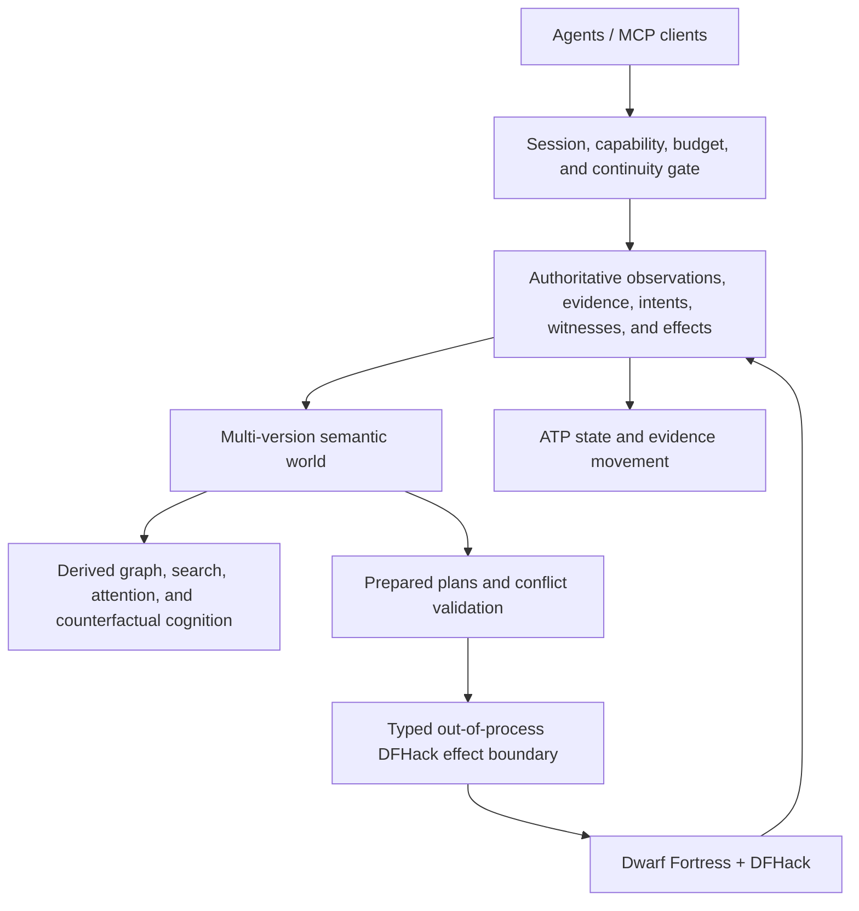

# dwarf_fortress_mcp

**A semantic, transactional, replayable control plane for agents operating Dwarf Fortress as a
long-lived civilization rather than a keyboard-and-screen toy.**

> **Current status:** the repository contains a substantial authenticated **read-only** DFHack
> path, canonical live observations, an agent-oriented MCP server, exact compatibility machinery,
> owner-private anti-rollback custody, source-bound server qualification, and a non-bypassable
> single-use launch boundary. The checked-in compatibility registry is currently **empty**. No live
> tuple is admitted, no live mutation RPC exists, and the final current source generation has not
> yet earned a fresh full Rust qualification receipt. Read
> [`IMPLEMENTATION_STATUS.md`](IMPLEMENTATION_STATUS.md) before interpreting target architecture as
> deployed behavior.

The motivating problem is not merely “let an LLM press keys.” Dwarf Fortress is an unusually rich
long-horizon environment, but a naive automation layer would expose incomplete observations,
command acknowledgements mistaken for success, unsafe retries, version drift, unbounded output,
and no durable explanation of why the fortress reached its current state.

`dwarf_fortress_mcp` instead treats the game as a partially observed, continuously evolving typed
world. Its target is a small operating substrate for trustworthy agentic stewardship:

```text
observe exact state
→ orient economically
→ formulate semantic intent
→ prepare against witnessed state
→ revalidate authority and conflicts
→ commit idempotently
→ observe authoritative post-state
→ prove the goal or reconcile uncertainty
→ retain evidence for the next agent
```

## What is implemented now

### Authenticated read-only DFHack bridge

Protocol V1 exposes exactly two DFHack plugin methods:

```text
Handshake
ReadObservation
```

The implementation includes:

- loopback bearer-token authentication;
- bounded nonce, client, token, and payload domains;
- exact protocol/version/method manifests;
- no remote-service flag;
- no command, Lua, keyboard, arbitrary RPC, direct memory-write, or mutation route;
- stable unit-ID ordering and bounded citizen pagination;
- optional citizen-name projection;
- complete-roster coverage semantics;
- paused-world requirement for coherent multi-page reads;
- fail-closed restart, generation, nonce, version, ordering, malformed-wire, and budget checks.

The Rust trust domain uses supported out-of-process DFHack RPC. It contains no C/C++ FFI and
forbids unsafe Rust.

### Canonical live state

One complete bridge read becomes an immutable `LiveObservationCapsule`. The same observation
returned in one page or many contiguous pages produces identical canonical bytes and the same
SHA-256 identity.

The capsule projects deterministically into:

- one fortress entity;
- one entity per completely covered citizen;
- deterministic citizen-membership edges;
- fact-level provenance tied to the source capsule digest;
- explicit complete, conditional, and omitted coverage domains;
- a canonical state anchor with observation epoch and sequence.

The live adapter implements heartbeats, ordinary state advancement, bridge-restart resets,
clock-regression resets, world/site switch refusal, exact queries, explanations, and read-only
health diagnosis.

### Agent-facing MCP

The public MCP namespace remains the frozen eleven-tool waist:

| Tool | Role |
|---|---|
| `fortress.open_session` | Negotiate capabilities, budgets, fortress identity, and initial anchor. |
| `fortress.observe` | Refresh canonical state or return a heartbeat. |
| `fortress.query` | Run bounded semantic queries. |
| `fortress.plan` | Compile an intent in modes that support planning. |
| `fortress.commit` | Commit a prepared plan in modes that support effects. |
| `fortress.wait` | Poll active work or refresh when useful. |
| `fortress.cancel` | Request and reconcile cancellation in effect-capable modes. |
| `fortress.checkpoint` | Create a recovery point in checkpoint-capable modes. |
| `fortress.restore` | Restore into a new observation epoch. |
| `fortress.explain` | Explain state, provenance, plans, decisions, or failures. |
| `fortress.doctor` | Diagnose compatibility, bridge, state, and recovery posture. |

The live V1 server grants only:

```text
doctor
observe
query
wait
```

The remaining tools stay registered for protocol stability and fail closed without reaching an
effect path.

Every result converges on a canonical Agent Turn Packet containing:

```text
identity + exact anchor + continuity
briefing + semantic changes + ranked attention
active work + legal affordances + next protocol steps
uncertainty + coverage + budget + typed references
```

After admitted startup, every live Agent Turn also exposes the exact entry, registry, decision,
monotonic-floor, server-receipt, launch, ticket, and executable digests that authorized the process.
Those fields explain authority; they do not create more authority.

## Exact admission, not “works on my machine”

Source presence is not compatibility evidence. A live tuple must pass:

```text
R1 native plugin build and binary inventory
R2 authentication and non-disclosure matrix
R3 deterministic complete-read matrix
R4 restart, drift, gap, and partial-publication fencing
R5 cold-agent semantic orientation
```

Only then may one exact source/plugin/version/platform tuple be promoted into:

```text
architecture/live_compatibility_registry_v1.json
```

The registry currently contains no entries. Therefore the current repository does **not** claim a
runnable admitted live configuration.

### Local anti-rollback floor

A deployment host additionally maintains an owner-only monotonic floor for the last accepted
registry bytes:

```text
architecture/live_compatibility_floor_v1.json
scripts/live_compatibility_floor.py
```

The floor uses exact `0700` directory and `0600` file custody, no-follow opens, compare-and-swap,
atomic fsynced replacement, a monotonic sequence, a digest chain, and an append-only entry-ID
policy. An older but structurally valid registry cannot replace the trusted generation unnoticed.

The floor does not admit a tuple, provide distributed consensus, or defend against compromise of
the owning account or root.

### Authority-free readiness doctor

Before touching a bridge secret or executing a binary:

```bash
python3 scripts/doctor_live_admission.py \
  /path/to/live-deployment-manifest.json \
  --registry architecture/live_compatibility_registry_v1.json \
  --compatibility-floor /private/dfmcp/live-compatibility-floor.json \
  --require-entry-id <64-hex-entry-id>
```

The deterministic doctor checks registry, floor, exact tuple, and optional server artifact. Its
successful states are `compatibility_ready` and `artifact_preflight_ready`. It is authority-free:
it does not execute the server, connect to DFHack, read the bearer token, alter custody, or grant
capabilities.

### Source-bound server and process admission

A release server is separately qualified against the exact clean source, local qualification
receipt, platform, source-file digests, executable checks, size, and SHA-256.

The admitted launcher then:

- verifies the exact registry and trusted floor;
- resolves the explicitly required entry;
- verifies the source-bound server receipt;
- rejects loader-injection variables;
- opens the executable without following a symlink;
- verifies owner, mode, device, inode, length, and SHA-256;
- re-reads registry and floor after artifact verification and immediately before execution;
- re-hashes the already-open executable before ticket issue and before descriptor-only `execve`;
- issues an owner-only single-use ticket containing no bridge secret.

The Rust process consumes the ticket, verifies the process/floor/receipt/executable proof again,
deletes the ticket, and starts the private live MCP runner. Direct `serve-live` invocation fails
closed.

See [`docs/LIVE_COMPATIBILITY_ADMISSION.md`](docs/LIVE_COMPATIBILITY_ADMISSION.md).

## The larger architecture

The project is one synthetic system with three authority-separated planes.



### Authoritative plane

The only source of truth for what was observed, what effect was attempted, and what was proved:

- immutable observation capsules;
- multi-version semantic state;
- explicit positive, negative, range, aggregate, spatial, and epoch witnesses;
- sealed plans and idempotent effects;
- bounded obligations;
- checkpoints, reconciliation, evidence, and compatibility epochs.

### Cognition plane

Discardable, rebuildable, anchor-bound intelligence:

- graph and spatial projections;
- deterministic graph algorithms and decision witnesses;
- search and knowledge generations;
- attention, affordances, recommendations, and counterfactuals;
- evidence-gated memory export.

It can propose an intent. It cannot authorize or dispatch an effect.

### Effect plane

The smallest possible registered vocabulary over a versioned DFHack bridge. The intended mutation
protocol is always:

```text
prepare → revalidate → commit → observe → prove
```

A transport acknowledgement is not game success, and game mutation is not goal completion.
Unknown outcomes remain indeterminate until observation and operation lookup reconcile them.

## Franken substrate synthesis

The architecture intentionally imports the strongest ideas from the owned ecosystem rather than
adding broad external dependencies:

| Project | Accretive role |
|---|---|
| [`asupersync`](https://github.com/Dicklesworthstone/asupersync) | Sole async runtime, structured concurrency, cancellation, deterministic lab, ATP foundation. |
| [`frankensqlite`](https://github.com/Dicklesworthstone/frankensqlite) | MVCC, witnessed reads, negative SSI, deterministic rebase, certified merge. |
| [`frankenfs`](https://github.com/Dicklesworthstone/frankenfs) | Root-last publication, crash matrices, generation fencing, retrievability. |
| [`frankensearch`](https://github.com/Dicklesworthstone/frankensearch) | Progressive bounded cognition, immutable generations, explicit completeness. |
| [`franken_markdown`](https://github.com/Dicklesworthstone/franken_markdown) | Dependency-light semantic extraction, exact spans, transactional sibling publication. |
| [`frankengraphdb`](https://github.com/Dicklesworthstone/frankengraphdb) | One version universe, incremental graph projections, branch-per-agent experiments. |
| [`franken_networkx`](https://github.com/Dicklesworthstone/franken_networkx) | Canonical graph semantics, tie-break policies, complexity and decision witnesses. |
| [`fastmcp_rust`](https://github.com/Dicklesworthstone/fastmcp_rust) | Owned modern-only MCP 2026-07-28 presentation plane. |
| [`eidetic_engine_cli`](https://github.com/Dicklesworthstone/eidetic_engine_cli) | Evidence-linked advisory campaign memory with no authority path. |
| [`doodlestein_self_releaser`](https://github.com/Dicklesworthstone/doodlestein_self_releaser) | Local/self-hosted qualification and exact release asset contracts. |

The production dependency universe is closed. Rust is 2024 edition on the latest nightly, unsafe
code is forbidden, `asupersync` is the sole async runtime, and broad substitute frameworks are not
admitted. See [`docs/DEPENDENCY_POLICY.md`](docs/DEPENDENCY_POLICY.md) and
[`FRANKENSTACK_DEEP_DIVE.md`](FRANKENSTACK_DEEP_DIVE.md).

## Build and qualify

The normative local gate is:

```bash
./scripts/qualify_local.sh
```

It is intended to run on controlled local or self-hosted machines. GitHub workflow files are
portable job specifications for `doodlestein_self_releaser`, `act`, or controlled hosts; they are
not correctness authority.

A static-only or missing-Rust run is development evidence, never release evidence. Full local
qualification requires:

```text
clean source
locked/offline metadata
rustfmt
Clippy with warnings denied
workspace debug and release tests
warning-free rustdoc
executable contract/doctor/demo checks
all repository, bridge, acceptance, compatibility, floor, doctor, receipt, launcher, and ticket gates
```

After local qualification, qualify the release server binary separately:

```bash
scripts/qualify_live_server_binary.sh \
  target/qualification/<run>/qualification-receipt.json \
  target/live-server-binary-qualification/<run>
```

## Immediate roadmap

1. Run the final source generation through full latest-nightly local qualification with no skipped
   Rust gates.
2. Produce a source-bound release-server receipt for that exact clean commit.
3. Run R1 and the complete R2-R5 disposable-fort campaign for one exact current tuple.
4. Review and promote that tuple into the checked-in registry.
5. Advance a deployment host’s monotonic floor and prove `artifact_preflight_ready`.
6. Start live MCP only through the descriptor-bound admitted launcher.
7. Expand read coverage in separate evidence generations: announcements/events, jobs, items,
   buildings, then bounded map state.
8. Introduce pause/resume only as a separately versioned, witnessed, idempotent, reconciled, and
   disposable-fort-qualified mutation generation.

## Documentation map

Start here:

1. [`IMPLEMENTATION_STATUS.md`](IMPLEMENTATION_STATUS.md) — what is actually established.
2. [`AGENTS.md`](AGENTS.md) — normative engineering rules.
3. [`docs/AGENT_OPERATING_MODEL.md`](docs/AGENT_OPERATING_MODEL.md) — synthetic agent control loop.
4. [`ARCHITECTURE.md`](ARCHITECTURE.md) — compact system map.
5. [`COMPREHENSIVE_PLAN_FOR_DWARF_FORTRESS_MCP.md`](COMPREHENSIVE_PLAN_FOR_DWARF_FORTRESS_MCP.md) — full target plan.
6. [`FRANKENSTACK_DEEP_DIVE.md`](FRANKENSTACK_DEEP_DIVE.md) — source-level substrate synthesis.
7. [`MCP_SURFACE.md`](MCP_SURFACE.md) — frozen protocol waist.
8. [`docs/LIVE_DFHACK_READ_PATH.md`](docs/LIVE_DFHACK_READ_PATH.md) — read-only live implementation.
9. [`docs/LIVE_COMPATIBILITY_ADMISSION.md`](docs/LIVE_COMPATIBILITY_ADMISSION.md) — exact evidence and launch chain.
10. [`docs/LOCAL_QUALIFICATION_AND_RELEASE.md`](docs/LOCAL_QUALIFICATION_AND_RELEASE.md) — local trust model.
11. [`ROADMAP.md`](ROADMAP.md) — gate-based next steps.

## Non-goals and hard refusals

This project does not accept:

- arbitrary command or Lua execution through the default MCP surface;
- direct memory scraping or C/C++ FFI in the Rust trust domain;
- hidden second async runtimes;
- inference, memory, attention, or recommendation as mutation authority;
- absence claims without complete-domain coverage;
- retrying indeterminate effects blindly;
- path-based fallback after qualifying a different executable inode;
- treating source presence, unit tests, old receipts, or a green badge as current live evidence.

The standard is not “the command ran.” The standard is exact state, bounded authority, deterministic
behavior, replayable evidence, and honest uncertainty.
