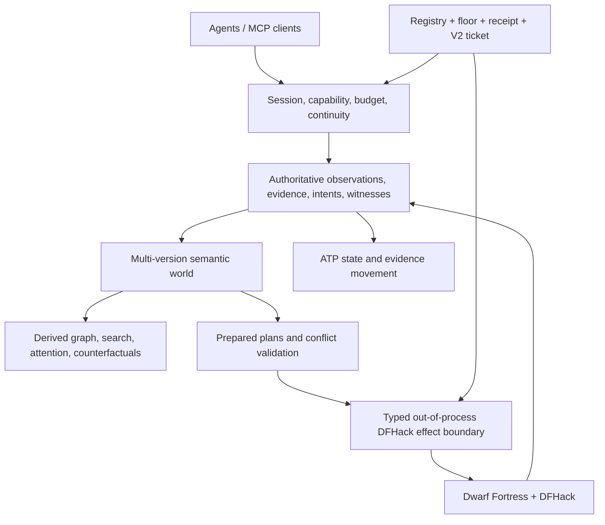

# dwarf_fortress_mcp

**A semantic, transactional, replayable control plane for agents operating Dwarf Fortress as a
long-lived civilization rather than a keyboard-and-screen toy.**

> **Current status:** the repository contains an authenticated protocol-1.0 **read-only** DFHack
> stack, canonical live citizen observations, an agent-oriented MCP server, exact compatibility and
> anti-rollback machinery, source-bound executable qualification, a protocol-bound V2 process
> boundary, and an implemented protocol-1.1 retained-announcement development stack. The checked-in
> compatibility registry is **empty**. No live tuple is admitted, protocol 1.1 is not in the
> production runner map, no live mutation RPC exists, and the final current source generation has
> no newly checked-in full qualification receipt. Read
> [`IMPLEMENTATION_STATUS.md`](IMPLEMENTATION_STATUS.md) before interpreting target architecture as
> deployed behavior.

The motivating problem is not merely “let a model press keys.” Dwarf Fortress is an unusually rich
long-horizon environment, but a naive automation layer would expose incomplete observations,
command acknowledgements mistaken for success, unsafe retries, version drift, unbounded output,
and no durable explanation of why the fortress reached its current state.

`dwarf_fortress_mcp` instead treats the game as a partially observed, continuously evolving typed
world:

```text
observe exact state
→ orient economically
→ formulate semantic intent
→ prepare against witnessed state
→ revalidate authority and conflicts
→ commit idempotently
→ observe authoritative post-state
→ prove the goal or reconcile uncertainty
→ retain evidence for the next agent
```

## Implemented source

### Protocol 1.0: authenticated citizen reads

The production-source bridge exposes exactly:

```text
Handshake
ReadObservation
```

It includes:

- loopback bearer-token authentication;
- bounded nonce, client, token, frame, text, and payload domains;
- exact protocol, bridge, plugin, version, and method-manifest identity;
- stable unit-ID ordering and bounded citizen pagination;
- optional citizen-name projection;
- complete-roster coverage semantics;
- paused-world requirements for coherent multi-page assembly;
- fail-closed restart, generation, nonce, version, ordering, malformed-wire, and budget checks;
- no remote-service flag;
- no command, Lua, keyboard, arbitrary RPC, direct memory-write, filesystem, or mutation route.

The Rust trust domain uses supported out-of-process DFHack RPC. It contains no C/C++ FFI and forbids
unsafe Rust.

### Protocol 1.1: retained-announcement reads

Protocol 1.1 keeps the same two-method native waist and adds bounded announcement fields inside
`ReadObservation`. It has a distinct protobuf package, plugin, bridge version, source contract,
native receipt, A1-A6 acceptance campaign, evidence journal, diagnostic probe, adapter, and
separately named development MCP binary.

The canonical announcement model provides:

- strictly increasing report IDs;
- 512-record and 2,048-byte-per-text ceilings;
- oldest and latest retained report identity;
- explicit `gap_before_window` evidence;
- explicit `complete_through_latest` evidence;
- retained-suffix completeness distinct from complete fortress history;
- deterministic world entities, coverage, briefing, attention, and report-ID changes;
- no text-derived authority and no mutation method.

Citizen pagination and announcement continuation publish transactionally. No combined capsule is
visible until every required page agrees on the same observation instant and both domains are
complete under their declared limits.

Bootstrap uses one complete combined capsule. A primed replay layer supplies fortress identity,
source digest, and adapter initialization without another underlying bridge read, preserving the
full two-dimensional request surface:

```text
citizen pagination × announcement continuation
```

The development runtime is:

```bash
DFMCP_ALLOW_UNADMITTED_LIVE_V1_1=1 \
DFMCP_BRIDGE_TOKEN='<32..256-byte loopback secret>' \
cargo run --locked --bin dfmcp-live-v1-1-dev-server
```

It is explicitly unadmitted. It rejects production admission environment state, uses a distinct
session namespace, cannot consume a production ticket, and cannot appear in admitted Agent Turn
provenance.

See [`docs/LIVE_ANNOUNCEMENT_STREAM.md`](docs/LIVE_ANNOUNCEMENT_STREAM.md) and
[`docs/LIVE_ANNOUNCEMENT_IMPLEMENTATION_STATUS.md`](docs/LIVE_ANNOUNCEMENT_IMPLEMENTATION_STATUS.md).

### Canonical live state

A complete bridge publication becomes an immutable observation capsule. Transport pagination is not
canonical state: equivalent one-page and multi-page reads produce identical canonical bytes and the
same SHA-256 identity.

Current projections include:

- fortress identity, version manifest, clock, pause state, and citizen count;
- one entity per completely covered citizen;
- deterministic citizen-membership edges;
- optional citizen names plus profession, position, and basic status;
- protocol-1.1 announcement event entities and retained-window coverage;
- fact-level provenance tied to the source capsule digest;
- explicit complete, conditional, partial, and omitted domains;
- canonical anchors with observation epoch and sequence.

The live adapters implement heartbeats, ordinary state advancement, restart and clock-regression
resets, world/site/version switch refusal, exact queries, explanations, and read-only health
diagnosis.

### Agent-facing MCP

The public namespace remains the frozen eleven-tool waist:

| Tool | Role |
|---|---|
| `fortress.open_session` | Negotiate capabilities, budgets, fortress identity, and initial anchor. |
| `fortress.observe` | Refresh canonical state or return a heartbeat. |
| `fortress.query` | Run bounded semantic queries. |
| `fortress.plan` | Compile an intent in modes that support planning. |
| `fortress.commit` | Commit a prepared plan in modes that support effects. |
| `fortress.wait` | Poll active work or refresh when useful. |
| `fortress.cancel` | Request and reconcile cancellation in effect-capable modes. |
| `fortress.checkpoint` | Create a recovery point in checkpoint-capable modes. |
| `fortress.restore` | Restore into a new observation epoch. |
| `fortress.explain` | Explain state, provenance, plans, decisions, or failures. |
| `fortress.doctor` | Diagnose compatibility, bridge, state, and recovery posture. |

Live read-only modes grant only:

```text
doctor
observe
query
wait
```

The remaining tools stay registered for protocol stability and fail closed without reaching an
effect path.

Every success and error converges on a canonical Agent Turn Packet:

```text
identity + exact anchor + continuity
briefing + semantic changes + ranked attention
active work + legal affordances + next protocol steps
uncertainty + coverage + budget + typed references
```

After admitted startup, Agent Turns also expose the exact bridge protocol, ticket, compatibility
entry, registry, decision, monotonic floor, server receipt, launch, and executable identities. Those
fields explain authority; they do not create more authority.

## Exact admission, not “works on my machine”

Source presence is not compatibility evidence. One exact tuple must pass:

```text
R1 native plugin build and binary inventory
R2 authentication and non-disclosure matrix
R3 deterministic complete-read matrix
R4 restart, drift, gap, and partial-publication fencing
R5 cold-agent semantic orientation
```

Protocol 1.1 additionally requires its complete A1-A6 announcement campaign and a re-executed
baseline citizen campaign under protocol 1.1.

Only reviewed evidence may be promoted into:

```text
architecture/live_compatibility_registry_v1.json
```

The registry currently has zero entries. Therefore the repository does not claim a runnable
admitted live configuration.

### Local anti-rollback floor

A deployment host separately maintains an owner-only monotonic floor for the last accepted exact
registry bytes:

```text
architecture/live_compatibility_floor_v1.json
scripts/live_compatibility_floor.py
```

The floor uses exact `0700` directory and `0600` file custody, no-follow reads, compare-and-swap,
atomic fsynced replacement, a monotonic sequence, a digest chain, and preservation of every prior
accepted entry ID. An older but valid registry cannot silently replace the trusted generation.

The floor is local custody. It does not admit a tuple, implement distributed consensus, or defend
against compromise of the owning account or root.

### Authority-free readiness doctor

Before touching a bridge secret or executing a binary:

```bash
python3 scripts/doctor_live_admission.py \
  /path/to/live-deployment-manifest.json \
  --registry architecture/live_compatibility_registry_v1.json \
  --compatibility-floor /private/dfmcp/live-compatibility-floor.json \
  --require-entry-id <64-hex-entry-id>
```

The deterministic doctor checks registry, floor, exact tuple, and optional server artifact. It does
not execute the server, connect to DFHack, read the bearer token, alter custody, or grant
capabilities.

### Protocol-bound V2 process boundary

`architecture/live_admission_ticket_v2.json` closes protocol confusion at the final launch seam. The
exact protocol must agree across:

```text
deployment manifest
→ compatibility decision
→ launch record
→ single-use ticket
→ DFMCP_ADMITTED_BRIDGE_PROTOCOL
→ Rust admission provenance
→ final private runner
```

Both launch and ticket digests cover the protocol. The production map currently contains only:

```text
1.0 → dwarf-fortress-mcp serve-live → private protocol-1.0 server
```

Protocol 1.1, unknown protocols, mismatches, and legacy V1 tickets fail before server startup. A
future protocol-1.1 production runner cannot be added safely until its separate source, native,
live, registry, floor, artifact, and dispatch evidence exists.

The launcher additionally verifies exact registry/floor generation, required entry ID, source-bound
server receipt, loader hygiene, executable owner/mode/device/inode/length/SHA-256, and descriptor
stability. It issues an exact-mode `0600` ticket inside a real exact-mode `0700` directory and
executes only the already-qualified descriptor. The Rust process repeats the process, protocol,
capability, custody, and executable checks, deletes the ticket, and only then starts MCP.

Direct `serve-live` invocation fails closed. No path-based execution fallback exists.

See [`docs/LIVE_COMPATIBILITY_ADMISSION.md`](docs/LIVE_COMPATIBILITY_ADMISSION.md).

## Canonical source custody

Release source is produced from one exact clean Git commit, not copied from an ambient worktree:

```bash
scripts/create_source_bundle.sh
```

The bundle system uses canonical Git archive modes and metadata, an ordered manifest of every
tracked regular blob, hostile tar verification without extraction, create-only verification
receipts, and sibling-directory atomic publication after every check succeeds.

A source bundle proves source and archive identity only. It does not prove compilation, tests,
compatibility, binary reproducibility, or runtime admission.

See [`docs/SOURCE_BUNDLE.md`](docs/SOURCE_BUNDLE.md).

## System architecture

The target is one synthetic system with authoritative, cognition, effect, and deployment-admission
boundaries.



### Authoritative plane

The only source of truth for what was observed, what effect was attempted, and what was proved:

- immutable observation capsules;
- multi-version semantic state;
- positive, negative, range, aggregate, spatial, and epoch witnesses;
- sealed plans and idempotent effects;
- bounded obligations;
- checkpoints, reconciliation, evidence, and compatibility epochs.

### Cognition plane

Discardable, rebuildable, anchor-bound intelligence:

- graph and spatial projections;
- deterministic graph algorithms and decision witnesses;
- search and knowledge generations;
- attention, affordances, recommendations, and counterfactuals;
- evidence-gated memory export.

It may propose an intent. It cannot authorize or dispatch an effect.

### Effect plane

The target mutation protocol is always:

```text
prepare → revalidate → commit → observe → prove
```

A transport acknowledgement is not game success, and game mutation is not goal completion. Unknown
outcomes remain indeterminate until observation and operation lookup reconcile them. The current
live protocols expose no mutation method.

## Franken substrate synthesis

| Project | Accretive role |
|---|---|
| [`asupersync`](https://github.com/Dicklesworthstone/asupersync) | Sole async runtime, structured concurrency, cancellation, deterministic lab, ATP foundation. |
| [`frankensqlite`](https://github.com/Dicklesworthstone/frankensqlite) | MVCC, witnessed reads, negative SSI, deterministic rebase, certified merge. |
| [`frankenfs`](https://github.com/Dicklesworthstone/frankenfs) | Root-last publication, crash matrices, generation fencing, retrievability. |
| [`frankensearch`](https://github.com/Dicklesworthstone/frankensearch) | Progressive bounded cognition, immutable generations, explicit completeness. |
| [`franken_markdown`](https://github.com/Dicklesworthstone/franken_markdown) | Dependency-light semantic extraction, exact spans, transactional sibling publication. |
| [`frankengraphdb`](https://github.com/Dicklesworthstone/frankengraphdb) | One version universe, incremental graph projections, branch-per-agent experiments. |
| [`franken_networkx`](https://github.com/Dicklesworthstone/franken_networkx) | Canonical graph semantics, tie-break policies, complexity and decision witnesses. |
| [`fastmcp_rust`](https://github.com/Dicklesworthstone/fastmcp_rust) | Owned modern-only MCP 2026-07-28 presentation plane. |
| [`eidetic_engine_cli`](https://github.com/Dicklesworthstone/eidetic_engine_cli) | Evidence-linked advisory campaign memory with no authority path. |
| [`doodlestein_self_releaser`](https://github.com/Dicklesworthstone/doodlestein_self_releaser) | Local/self-hosted qualification and exact release asset contracts. |

The production dependency universe is closed. Rust is 2024 edition on the latest nightly, unsafe
code is forbidden, `asupersync` is the sole async runtime, and broad substitute frameworks are not
admitted.

## Build and qualify

The normative local gates are:

```bash
./scripts/verify.sh
./scripts/qualify_local.sh
```

They are intended for controlled local or self-hosted machines. GitHub workflow files are portable
job specifications for `doodlestein_self_releaser`, `act`, or controlled hosts; they are not
correctness authority.

A static-only, dirty-tree, or missing-Rust run is development evidence, never release evidence. Full
local qualification requires exact source integrity, every Python/shell contract, locked/offline
Cargo metadata, rustfmt, warning-denied Clippy, debug and release tests, warning-denied rustdoc, and
executable checks.

Protocol 1.1 has a narrower source-only qualifier:

```bash
scripts/qualify_live_announcement_source.sh
```

It still does not prove a native plugin build, A1-A6, baseline R2-R5, registry admission, or
production runtime admission.

After full local qualification, qualify the protocol-1.0 release server separately:

```bash
scripts/qualify_live_server_binary.sh \
  target/qualification/<run>/qualification-receipt.json \
  target/live-server-binary-qualification/<run>
```

## Immediate roadmap

1. Produce a full latest-nightly clean-head qualification receipt.
2. Qualify the exact protocol-1.0 server binary.
3. Run R1-R5 for one exact current protocol-1.0 tuple.
4. Review and promote it, advance a deployment floor, and launch through the V2 protocol boundary.
5. Separately qualify protocol 1.1 source, native plugin, A1-A6, and baseline R2-R5.
6. Add a protocol-1.1 production runner only after its complete evidence chain exists.
7. Expand read coverage through jobs, items, buildings, and bounded map state.
8. Add pause/resume only as a separately versioned, witnessed, idempotent, reconciled mutation
   generation.

## Documentation map

1. [`IMPLEMENTATION_STATUS.md`](IMPLEMENTATION_STATUS.md) — exact present evidence posture.
2. [`AGENTS.md`](AGENTS.md) — normative engineering rules.
3. [`docs/AGENT_OPERATING_MODEL.md`](docs/AGENT_OPERATING_MODEL.md) — synthetic agent control loop.
4. [`ARCHITECTURE.md`](ARCHITECTURE.md) — compact system map.
5. [`COMPREHENSIVE_PLAN_FOR_DWARF_FORTRESS_MCP.md`](COMPREHENSIVE_PLAN_FOR_DWARF_FORTRESS_MCP.md) — full target plan.
6. [`FRANKENSTACK_DEEP_DIVE.md`](FRANKENSTACK_DEEP_DIVE.md) — source-level substrate synthesis.
7. [`MCP_SURFACE.md`](MCP_SURFACE.md) — frozen protocol waist.
8. [`docs/LIVE_DFHACK_READ_PATH.md`](docs/LIVE_DFHACK_READ_PATH.md) — protocol-1.0 read path.
9. [`docs/LIVE_ANNOUNCEMENT_STREAM.md`](docs/LIVE_ANNOUNCEMENT_STREAM.md) — protocol-1.1 announcement semantics.
10. [`docs/LIVE_COMPATIBILITY_ADMISSION.md`](docs/LIVE_COMPATIBILITY_ADMISSION.md) — exact evidence and V2 launch chain.
11. [`docs/LOCAL_QUALIFICATION_AND_RELEASE.md`](docs/LOCAL_QUALIFICATION_AND_RELEASE.md) — local trust model.
12. [`docs/SOURCE_BUNDLE.md`](docs/SOURCE_BUNDLE.md) — canonical source custody.
13. [`ROADMAP.md`](ROADMAP.md) — gate-based next steps.

## Hard refusals

This project does not accept:

- arbitrary command or Lua execution through the default MCP surface;
- direct memory scraping or C/C++ FFI in the Rust trust domain;
- hidden second async runtimes;
- inference, memory, attention, recommendations, or text as mutation authority;
- absence claims without complete-domain coverage;
- retrying indeterminate effects blindly;
- path-based fallback after qualifying a different executable inode;
- protocol selection that is not covered by the compatibility, launch, and ticket digests;
- treating source presence, development execution, unit tests, old receipts, or a green badge as
  current live evidence.

The standard is not “the command ran.” The standard is exact state, bounded authority,
deterministic behavior, replayable evidence, and honest uncertainty.
